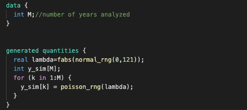
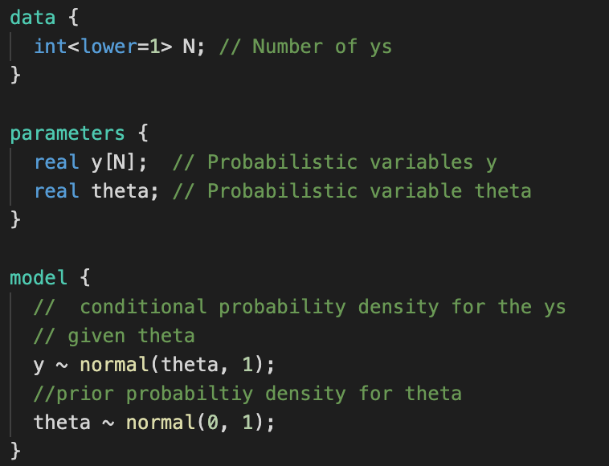
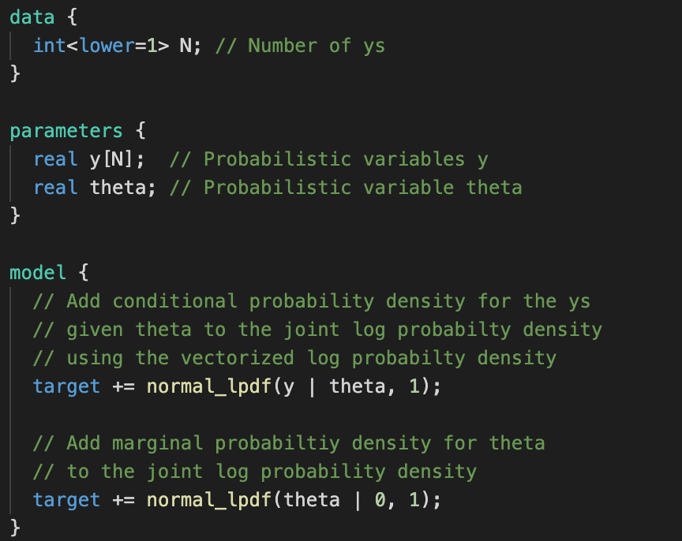
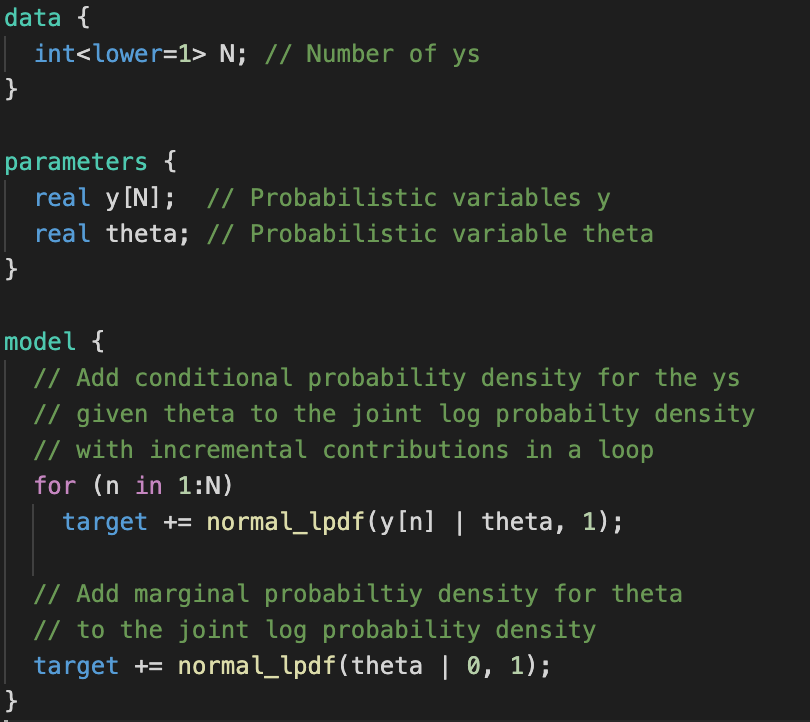
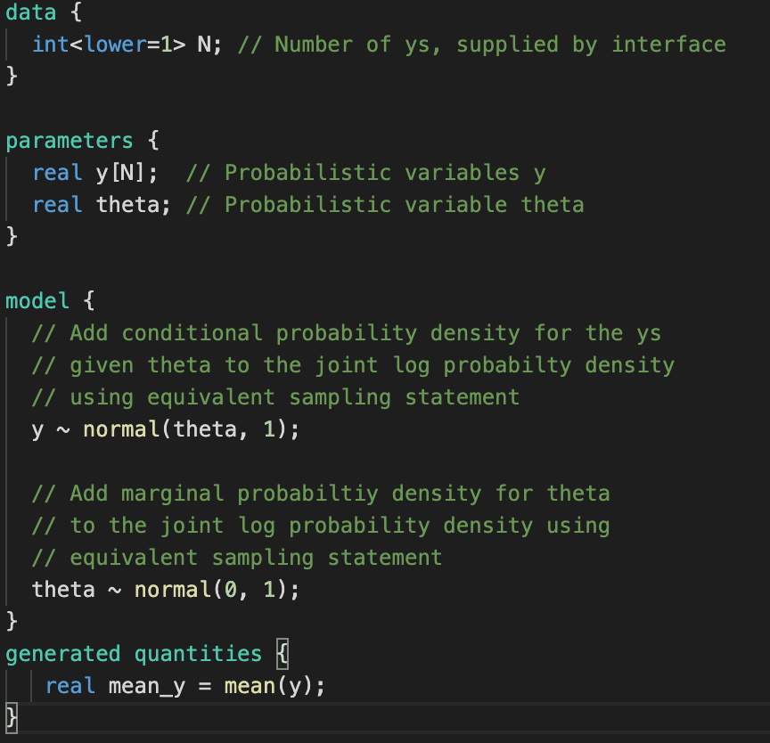
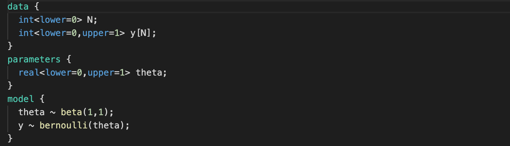
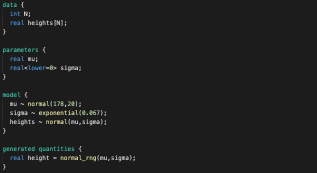

# Intro to stan linear model


Necessary packages to complete tasks

```python
from cmdstanpy import CmdStanModel


import arviz as az
import numpy as np
import scipy.stats as stats

import matplotlib.pyplot as plt
import pandas as pd

```


F - number of letters in first name
L - number of letters in last name
## Excercise 1 - generated quantities
```code_1.stan```



1. Compile code_1.stan and sample from it using M=F
2. Create a pandas dataframe from resulting draws.
3. Plot a histogram for each of y_sim and lambda

### Excercise 2 - different methods of defining models

Stan models can be defined using sampling statements

```code_2.stan```



However, what we really happens is that we are defining logarithm of the joint probability distribution, i.e.:

$$
\log p(\mu,\theta)=\log p(\mu|\theta)+\log p(\theta)
$$

Such declaration is done in the following way 


```code_3.stan```



But specification can be even more detailed, and model can affect even individual coeeficients of vector parameters

```code_4.stan```



1. Implement all the examples
2. Use them to generate distributuion for N=F.


### Excercise 3 - generated quantities post sampling

Sometimes more than in parameters we are interested in their functions. 


```code_5.stan```



Unfortunately, such interest can happen after we complete sampling which can be often time consuming. We can do such analysis in python or directly on samples, but cmdstan allows us to solve it in a different way. 

1. Implement ```code_5.stan```
2. Using generate_quantities() method use samples from previous excercises and and analyze mean of $y$.


## Excercise 4 - Binominial example
```stan_6.stan```



Using binomial model fit the theta parameter to the data. 


## Excercise 5 - linear model 

We focus on models in the form
$$ y \sim
 \mathrm{Normal}(\alpha+X\beta,\sigma) $$
    
or in generalized form (generalized linear models)

$$ f(y) \sim \mathrm{Normal}(\alpha+X\beta,\sigma) $$
    
where $f(y)$ is a link function, for example - logit.

We will try to fit $\mathrm{Normal}(\mu,\sigma)$ distribution to height data. Special case of linear model with $\beta=0$.

Get data set:

```python
_BASE_URL = "https://raw.githubusercontent.com/rmcelreath/rethinking/Experimental/data"
HOWELL_DATASET_PATH = f"{_BASE_URL}/Howell1.csv"
d = pd.read_csv(HOWELL_DATASET_PATH, sep=';', header=0)
d=d[d.age>=18] #just adults 
d.head()
```
Simple model: 
```code_7.stan```



Run model 
```python
model_ppc=CmdStanModel(stan_file='code_7.stan')

R = 1000
sim=model_ppc.sample(iter_sampling=R,
                     iter_warmup=0,
                     chains=1,
                     fixed_param=True,
                     seed=29042020,refresh=R)
```

Model fit and evaluation:
- Plot a joint distribution of fitted mu and sigma.
- Plot histograms of data and simulated heights and evaluate the quality of model.

